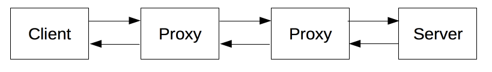

# HTTP

## HTTP 组件系统

客户端 -- 客户端代理 -- 代理...代理 -- 服务器代理 -- 服务器

### 客户端 用户代理

最先发起请求。

### 服务端

一个服务端可以假装表现为仅有一台机器，但实际上，它可以是共享负载的一组服务器集群（负载均衡）。

### 代理

作用： 缓存，过滤，负载均衡，认证，日志

## HTTP 基本性质

**无状态 有会话** HTTP 是无状态的--在同一个连接中，两个执行成功的请求之间是没有关系的。这就带来了一个问题，用户没有办法在同一个网站中进行连贯的交互，比如在电商网站中使用购物车功能。尽管 HTTP 根本上来说是无状态的，但借助 HTTP Cookie 就可使用有状态的会话。利用标头的扩展性，HTTP Cookie 被加进了协议工作流程，每个请求之间就能够创建会话，让每个请求都能共享相同的上下文信息或相同的状态。

- HTTP会话：一个会话分为三个阶段：
  - 建立连接：
   TCP连接，默认为80端口。
  - 客户端发送请求并等待应答。
   RSETful接口规定的发送请求的方式。
  - 服务器处理请求并送回应答，包括状态码和数据。
   返回状态码，配置块，数据块。

## HTTP 身份验证

**BEAR TOKEN** 是一种常用于OAuth 2.0授权框架中的访问令牌类型。它是一种用于访问受保护资源的令牌，通常用于身份验证和授权。

## HTTP 缓存

**私有缓存**  通常指向浏览器缓存。`Cache-Control: private`

**共享缓存** 位于客户端和服务器之间，存储用户之间共享的响应。

- 代理缓存：随着https普遍，代理缓存逐渐弃用。
- 托管缓存：由服务开发人员明确部署来降低原服务器负载的交付内容。包括 反向代理, CDN, service worker+缓存API
